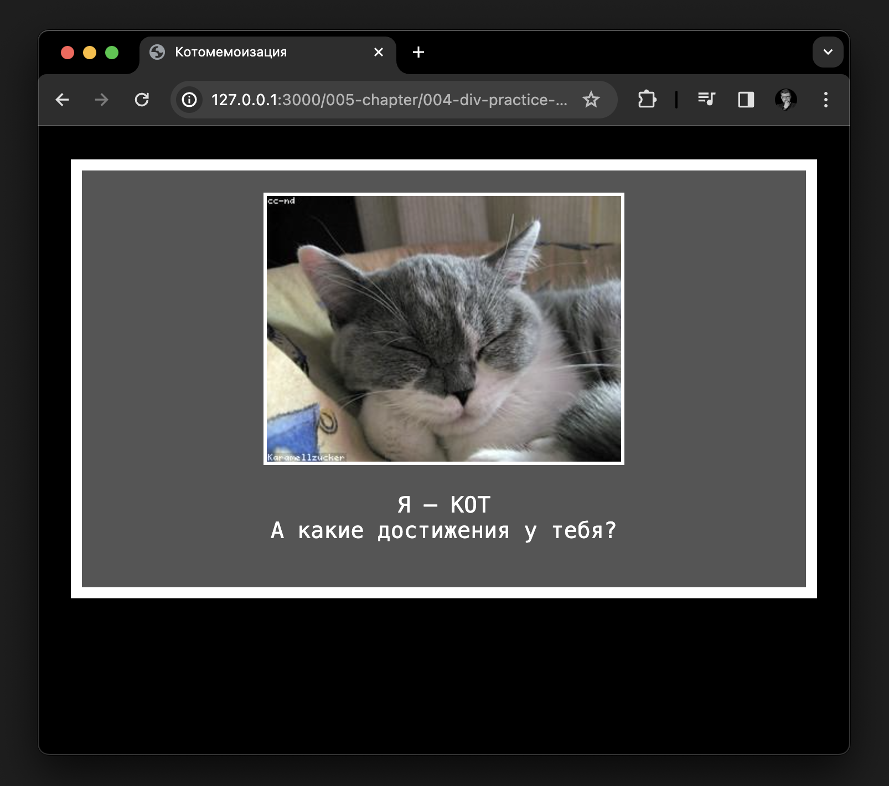

# Техническое задание для создания сайта "Котомемоизация"

## Senior перейти на [junior](./readme-junior.md)

1. **Общее описание:**
   - **Название сайта:** Котомемоизация
   - **Цель сайта:** Отображение мемного контента с изображением котов и сопроводительным текстом.
   - **Технологии:** HTML, CSS.
   - **Совместимость:** Сайт должен корректно отображаться на различных устройствах и браузерах.
 
   - Примерный вид
   
2. **Структура сайта:**
   - Сайт должен содержать одну HTML-страницу с необходимыми разделами.
   - Структура HTML-файла:
     ```html
     <!DOCTYPE html>
     <html lang="ru">
     
     <head>
         <!-- Мета-теги и стили -->
     </head>
     
     <body>
         <!-- Контент сайта -->
     </body>
     
     </html>
     ```

3. **Мета-теги:**
   - **Charset:** UTF-8.

4. **Заголовок страницы:**
   - **Title:** "Котомемоизация".

5. **Стили:**
   - Создать внутренние стили в теге `<style>` внутри `<head>`.
   - Использовать стили для body, .meme-container, img.
   - Цвет фона body: #000.
   - Цвет текста .meme-container: #fff.
   - Рамка у .meme-container: 10px белого цвета.
   - Рамка у img: 3px белого цвета.

6. **Контент .meme-container:**
   - Расположить в центре страницы блок .meme-container.
   - Внутри .meme-container должен быть тег `` с классом "meme-image" и атрибутом src, содержащим ссылку на изображение (например, "https://loremflickr.com/320/240?lock=7").
   - Под изображением добавить абзац `<p>` с текстом.
   - Текст внутри `<p>`:
     ```html
     Я — КОТ<br>
     А какие достижения у тебя?
     ```

7. **Размещение изображения:**
   - Подобрать изображение мемного кота с размерами 320x240 пикселей.

8. **Внешний вид:**
   - Шрифт для текста: monospace.
   - Размер шрифта в .meme-container: 20px.

9. **Дополнительные требования:**
   - Сайт должен быть адаптивным для различных устройств.
   - Тестирование на различных браузерах для обеспечения корректного отображения.

10. **Проверка:**
   - Убедиться, что сайт корректно отображается на различных устройствах и браузерах.
   - Проверить верность соответствия стилей и макета.

11. **Дополнительные комментарии:**
   - При необходимости добавить комментарии в код для облегчения последующего понимания структуры и стилей.

## Junior


```html
<!DOCTYPE html>
<html lang="ru">

<head>
  <meta charset="UTF-8">
  <meta name="viewport" content="width=device-width, initial-scale=1.0">
  <title>Котомемоизация</title>
  <style>
    body {
      margin: 0px;
      background-color: #000;
    }

    .meme-container {
      margin: 30px;
      padding: 20px;
      text-align: center;
      font-family: monospace;
    }

    img {
      border: 3px solid white;
    }
  </style>
</head>

<body>

  <div class="meme-container">
    

  </div>

</body>

</html>
```
