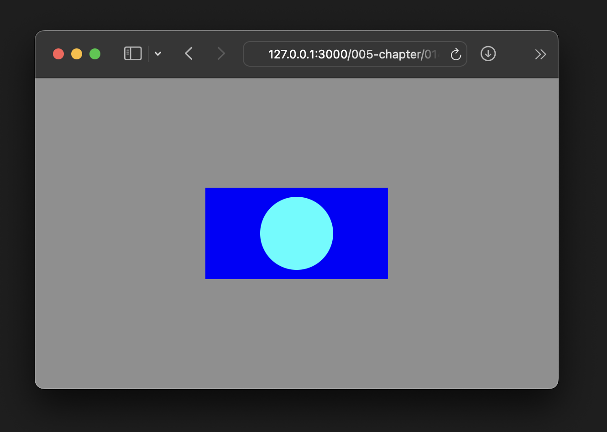

# Техническое задание

### Создание страницы с прямоугольником и кругом

### Цель проекта:

Создать веб-страницу, содержащую прямоугольник и круг, используя HTML и CSS.

### Требования:
1. **Внешний вид**

2. **Структура HTML:**
   - Создайте базовый HTML-документ с doctype, языком "ru" и мета-тегами для кодировки и viewport.
   - Внутри `<head>` задайте заголовок страницы ("Прямоугольник и круг").
   - Создайте два `
` элемента с классами "rectangle" и "circle" для размещения прямоугольника и круга соответственно.

3. **Стили CSS:**
   - Задайте цвет фона для `<body>`.
   - Определите стили для класса "rectangle":
     - Ширина: 200px.
     - Высота: 100px.
     - Цвет фона: синий.
     - Позиционирование: абсолютное.
     - Размещение по центру экрана.
   - Определите стили для класса "circle":
     - Ширина: 80px.
     - Высота: 80px.
     - Цвет фона: аква.
     - Радиус скругления: 50% (чтобы создать круг).
     - Позиционирование: абсолютное.
     - Размещение по центру экрана.

4. **Дополнительные стили (по желанию):**
   - Экспериментируйте с дополнительными стилями, такими как тени, градиенты или анимации, чтобы сделать вашу страницу более интересной.

### Отчётность:

1. Предоставьте HTML и CSS файлы, соответствующие требованиям.
2. Прикрепите скриншот вашей страницы в состоянии загрузки в браузере.

Успехов в создании вашей страницы!