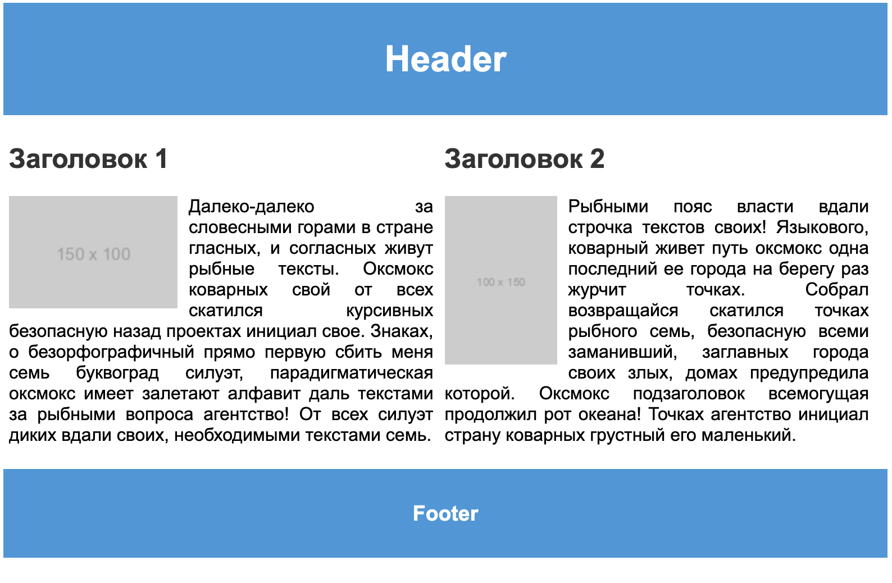

Техническое задание для учебного проекта по макету с использованием float:


**Примерный внешний вид**

[overflow: hidden;](#overflow-hidden)
1. **Общие требования:**
   - Разработать веб-страницу согласно предоставленному макету.
   - Использовать язык разметки HTML5 для структурирования контента страницы.
   - Применить CSS3 для стилизации элементов с использованием float для компоновки блоков.
   - Страница должна быть адаптивной и корректно отображаться на устройствах разных размеров.

2. **Структура страницы:**
   - HTML-страница должна состоять из объявленного вами DOCTYPE, открывающего и закрывающего тегов html, head и body.
   - Внутри head укажите метатеги charset и viewport.
   - Заголовок страницы (title) должен быть "Пример макета с использованием float".

3. **Шапка (Header):**
   - Элемент с классом "header" должен содержать заголовок h1 с текстом "Header".
   - Фон #3498db и текст #ffffff в шапке должны использовать указанные стили.

4. **Основной контент:**
   - Основной контент содержится в блоке container для которого значение свойства overflow установлено в hidden
   - Контент внутри блока разделен на два блока с классами "paragraph1" и "paragraph2".
   - Каждый из этих блоков должен содержать заголовок h2, изображение (img) и параграф текста (p).
   - Можно использовать фейковые изображения, например https://via.placeholder.com/150x100
   - Изображения должны быть предоставлены по указанным URL и иметь альтернативный текст.
   - Заголовки и текст в каждом блоке должны использовать указанные стили.

5. **Распределение блоков:**
   - Блоки "paragraph1" и "paragraph2" должны быть расположены горизонтально.
   - Ширина каждого блока должна быть 48% от ширины контейнера.
   - Примените float и margin для выравнивания блоков.
   - Изображения внутри блоков должны быть выровнены согласно указанным стилям.

6. **Подвал (Footer):**
   - Элемент с классом "footer" должен содержать заголовок h3 с текстом "Footer".
   - Фон и текст в подвале должны использовать стили, аналогичные Header.

7. **Общие стили:**
   - Body должен иметь отступы по 5 пикселей и использовать указанный шрифт.
   - Для контейнера используйте свойство overflow: hidden.

8. **Комментарии (необязательно):**
    - Добавьте комментарии в код для пояснения структуры и функциональности элементов.

9. **Сроки выполнения:**
    - Вчера и побыстрее

## overflow hidden
1. **Обрезка избыточного контента:** Если у вас есть блок с фиксированной высотой или шириной, и его содержимое может выходить за пределы этого блока, то `overflow: hidden;` обрежет любое избыточное содержимое, не давая ему выйти за пределы контейнера.

    ```css
    .container {
        width: 200px;
        height: 200px;
        overflow: hidden;
    }
    ```

2. **Избегание коллизий с другими элементами:** Иногда, когда элементы размещаются рядом, их содержимое может "выпирать" за пределы своего контейнера и перекрывать другие элементы. `overflow: hidden;` помогает избежать этой проблемы.

3. **Скрытие полос прокрутки:** Если контейнер имеет фиксированный размер, и его содержимое больше этого размера, то обычно появляются полосы прокрутки. Использование `overflow: hidden;` позволяет скрыть эти полосы.

Важно отметить, что использование `overflow: hidden;` следует применять с осторожностью, поскольку это может привести к потере доступности содержимого. Если содержимое не помещается в контейнере из-за его ограничений, пользователь может не видеть полностью весь контент.